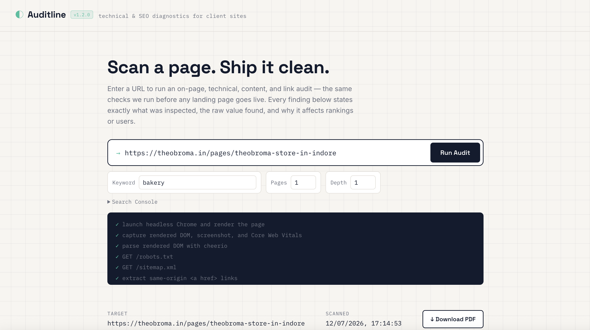
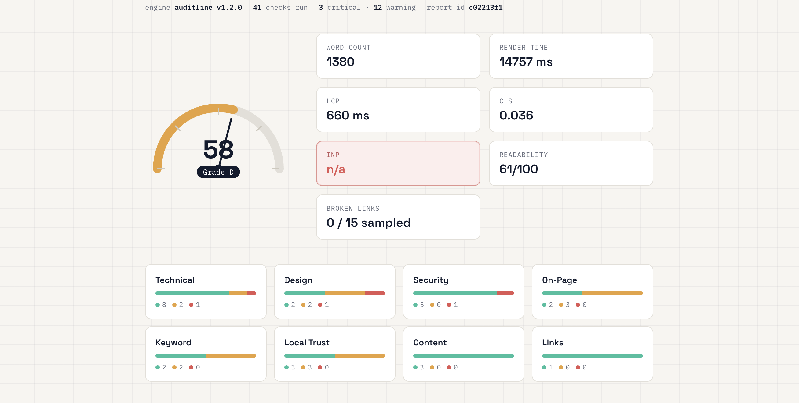
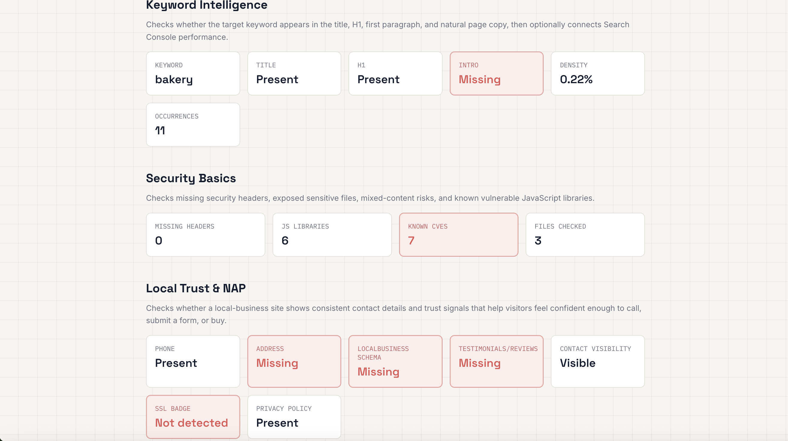
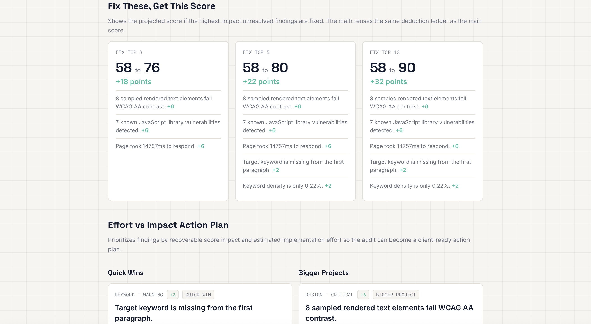
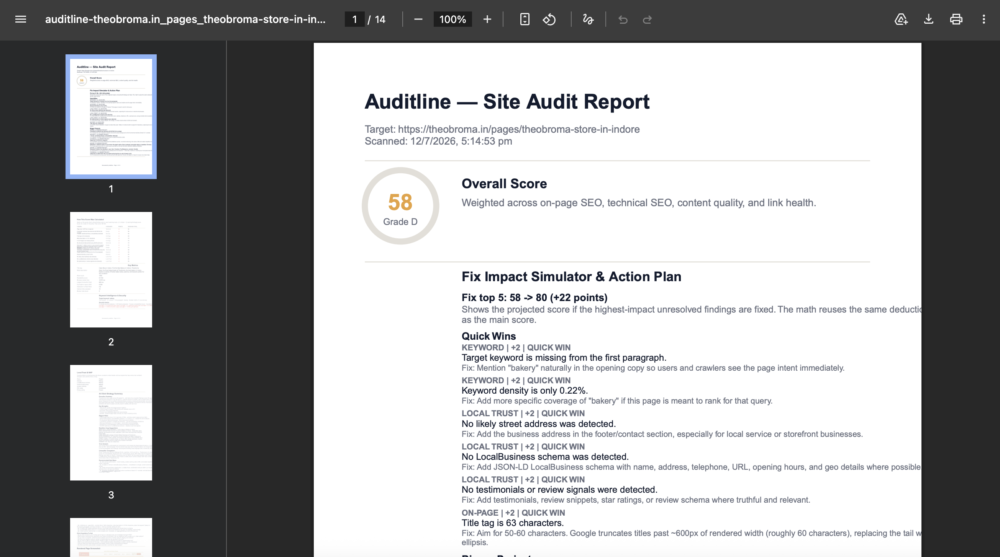

# Auditline — Automated SEO & Technical Website Audit Tool

Auditline is a full-stack site-auditing platform that crawls a website, runs it through
dozens of SEO, technical, content, design, and security checks, and turns the results into
a transparent, client-ready report — the kind of pre-launch QA pass an agency would
otherwise run by hand for every landing page.

## Why Auditline

Before a client site goes live, someone usually works through the same checklist: is the
title tag right, is HTTPS working, does every image have alt text, is the site fast enough,
is there a sitemap, are the headings in order. Doing this by hand for every page, on every
project, doesn't scale — and different reviewers catch different things.

Auditline automates that checklist end-to-end, and just as importantly, makes the resulting
score explainable. Instead of handing a client a single number, it shows exactly which
checks passed or failed, where on the page each issue lives, why it matters, how to fix it,
and how many points fixing it would recover. That turns an audit from "trust me, it's a 72"
into a report a client can actually act on.

### Homepage


## What It Does

1. **Crawls** a site across multiple pages (via Playwright + headless Chromium, with
   Axios/Cheerio for lightweight fetches), following internal links
2. **Runs checks** — on-page SEO, technical SEO, content quality, design/contrast, security,
   and local-business trust signals — against every crawled page, recording exact evidence
   and location for each finding
3. **Scores** the site with a full point-by-point deduction ledger and a blended
   per-page / site-wide formula
4. **Prioritizes** fixes into a Quick Wins vs. Bigger Projects action plan, and simulates the
   score lift from fixing the top N issues
5. **Optionally layers in AI** (OpenAI, xAI/Grok, or any OpenAI-compatible API) for an
   executive summary, rewritten copy, and competitor comparison
6. **Exports** everything to a client-ready PDF

## Features

### On-Page & Technical SEO
Title tag, meta description, H1 usage, heading hierarchy, image alt text, HTTPS,
viewport/mobile-friendliness, canonical tags, robots.txt, sitemap.xml, meta robots, language
attributes, Open Graph tags, favicon, mixed content, structured data (JSON-LD), page load
time, and Web Vitals-style measurements via Playwright.

### Multi-Page Crawling & Site-Wide Analysis
- Crawls multiple pages per scan — not just the single URL you paste in
- Site-wide duplicate content detection across crawled pages
- NAP (Name / Address / Phone) consistency checks across the whole site, not just one page

### Content & Readability
- Word count, a practical readability score, and section depth
- Splits each page at its own H2 headings and reports word count per section — naming the
  specific weak section by its actual heading text
- Text-to-HTML ratio and "wall of text" paragraph flagging

### Link Health
Samples internal links and flags broken ones.

### Audit Dashboard


### Results Overview


### Design & Engagement Audit
- Reads colors and fonts from inline styles, `<style>` blocks, and up to 6 linked external
  stylesheets (the norm for real client sites)
- Computes a WCAG contrast ratio between the detected primary color and background
- Checks for a clear above-the-fold call-to-action
- Surfaces the top 4 colors actually used most often across the page, with usage counts

### Every Finding Explains Itself
Each check reports the raw evidence found (e.g. the actual `<title>` text), a "why it
matters" explanation of the underlying mechanism (what a crawler or browser does with that
signal and why it affects rankings or users), a concrete fix, and — for on-page issues —
the exact location (CSS selector path, heading context, nearby text snippet) so a client
can find the problem without guessing.

### Full Score Breakdown Ledger
Not just a number — a running-total table showing every point deducted, which check caused
it, and why, so a client can see exactly how "72/100" was derived rather than taking it on
faith.

### "Fix These, Get This Score" Simulator
Reuses the same deduction ledger to project the score lift from fixing the top 3, 5, or 10
highest-impact issues — e.g. "fix these 5 items to move from 34 to 78."

### Effort-vs-Impact Action Plan
Tags every finding with rough implementation effort and splits the report into **Quick
Wins** and **Bigger Projects**, turning the audit into a prioritized proposal a business
client can act on.

### Keyword Intelligence
Optional target-keyword input checks placement in the title, H1, first paragraph, and
visible-text density. With a connected Google Search Console property and OAuth access
token, the report adds live clicks, impressions, CTR, and average position for matching
queries.

### Security Basics
Exposed `/.env` and `/.git/*` files, missing security headers (`Content-Security-Policy`,
`X-Frame-Options`, `Strict-Transport-Security`), mixed HTTP resources on HTTPS pages, and
known-vulnerable JavaScript library versions via OSV, with a local fallback for common
libraries.

### Local Trust & NAP Checks
For local-business clients: visible phone/address presence, NAP consistency across crawled
pages, LocalBusiness schema completeness, and conversion trust signals (testimonials,
visible contact info, SSL badge language, privacy policy links).

### AI-Powered Strategy Panel
Plug in an OpenAI or xAI (Grok) API key — or any OpenAI-compatible endpoint — to generate a
plain-English executive summary, rewritten copy suggestions, tone/audience analysis, a
competitor comparison from up to 3 competitor URLs, recommended next steps, and Q&A grounded
in the report.

### Dashboard UI
URL input, animated score gauge, a live scan log (console-style, shows each crawl/check step
as it runs), category breakdown, score breakdown ledger, most-used color swatches,
keyword/security/local-trust panels, the score-lift simulator, the action plan, a filterable
findings list with location/evidence/rationale, a methodology reference panel, and recent
scan history.

### PDF Export
One click generates a client-ready audit report — score summary, the full deduction ledger,
metrics, category breakdown, color swatches (rendered as actual swatches), every finding
with its location/evidence/rationale/fix, and a methodology appendix — via `pdfkit`, no
headless browser required for the export step itself.

## Tech Stack

- **Backend**: Node.js, Express, Axios, Cheerio
- **Browser rendering & crawling**: Playwright (headless Chromium) — multi-page crawling,
  JS-rendered pages, screenshots, rendered DOM, resource collection, Web Vitals-style
  measurements
- **Frontend**: Vanilla HTML/CSS/JS (no build step required)
- **Reports**: PDFKit
- **Optional integrations**: Google Search Console, OpenAI-compatible LLM APIs (OpenAI,
  xAI/Grok), OSV vulnerability data
- **Storage**: In-memory scan history (swap in MongoDB/PostgreSQL for production use)


### Detailed Findings


### PDF Report



## Project Structure

```
seo-analyzer/
├── server.js              # Express app entry point
├── routes/
│   └── analyze.js         # /api/analyze and /api/history endpoints
├── lib/
│   ├── crawler.js         # Multi-page crawl: fetches HTML, robots.txt, sitemap.xml
│   ├── checks.js          # On-page, technical, content checks (with exact locations)
│   ├── location.js        # Finds exact on-page location of an issue (section, snippet)
│   ├── designAnalysis.js  # Color/typography/CTA/density audit + top color extraction
│   ├── colorTheory.js     # Hex/HSL conversion and WCAG contrast ratio helpers
│   ├── scorer.js          # Weighted scoring + full point-by-point deduction ledger
│   ├── actionPlan.js      # Score simulator + effort-vs-impact proposal planner
│   └── pdfReport.js       # Generates the downloadable PDF audit report
└── public/
    ├── index.html         # Dashboard markup
    ├── style.css           # Design tokens + styling
    └── script.js            # Fetch calls, gauge animation, rendering
```

## Getting Started

### Quick Start

```bash
npm install
npm start
```

Then open **http://localhost:3000** and enter a URL to scan.

### One-Click Run

- **Mac**: double-click `Run SEO Analyzer.command`
- **Windows**: double-click `Run SEO Analyzer.bat`

The launcher installs missing dependencies, installs Playwright's Chromium build if needed,
opens the browser, and starts the server. See `RUN_APP.md` for details.

### Manual Setup (VS Code)

1. Install [Node.js](https://nodejs.org) (LTS, 18+) and confirm with `node -v` / `npm -v`
2. Unzip the project and open the folder in VS Code (`File > Open Folder…`)
3. Open the integrated terminal (`` Ctrl+` ``) and confirm you're in the project root
   (`package.json` should be visible)
4. Install dependencies:
   ```bash
   npm install
   ```
5. Start the server:
   ```bash
   npm start
   ```
6. Open **http://localhost:3000** in your browser
7. Enter a URL (e.g. `https://example.com`), click **Run Audit**, then **↓ Download PDF**
   once the scan completes

**Recommended VS Code extensions:** Prettier (formatting), ESLint (catches JS errors as you
type). *Live Server is not needed — the app runs its own Express server.*

## How Scoring Works

Every check returns a finding with a severity: `good`, `warning`, or `critical`. Each
crawled page starts at 100 points and deducts:

| Severity | Penalty |
|----------|---------|
| Critical | -6      |
| Warning  | -2      |
| Good     | 0       |

The final site score blends **70% average per-page score** with **30% site-wide technical
checks** (duplicate content, sitemap/robots coverage, and other cross-page signals), then
maps to a letter grade: **A** (90+), **B** (75+), **C** (60+), **D** (40+), **F** (below 40).

## Known Limitations (worth mentioning to clients transparently)

- **Color/font detection** scans inline styles, `<style>` blocks, and linked external
  stylesheets — but sites that set colors via a CSS framework's utility classes (e.g.
  Tailwind's `bg-blue-500`) rather than raw hex/rgb values won't be picked up, since there's
  no hex value in the markup or CSS to extract. The tool flags this explicitly rather than
  silently reporting zero colors as if that were meaningful.
- **Contrast ratio** is estimated from the two most common detected colors, not the actual
  computed foreground/background pairing of specific rendered text — treat it as a signal to
  investigate further with a real contrast checker (e.g. browser DevTools), not a certified
  WCAG audit result.
- **Crawl scope**: the crawler follows internal links from the starting URL; very large
  sites or unusual link structures may need scope/depth tuning for a complete picture.

## Roadmap

- Google PageSpeed Insights API integration for real field-data Core Web Vitals
- Persistent storage (MongoDB/PostgreSQL) with historical trend charts across scans
- Scheduled recurring scans with email alerts
- Re-scan diffing — track score and issue changes between scans over time
- Orphan page detection
- Redirect chain auditing
- Hreflang validation for multi-language sites
- Deeper structured competitor benchmarking beyond the AI panel's comparison

## Contributing

Issues and pull requests are welcome. If you're proposing a larger change, open an issue
first to discuss what you'd like to change.
